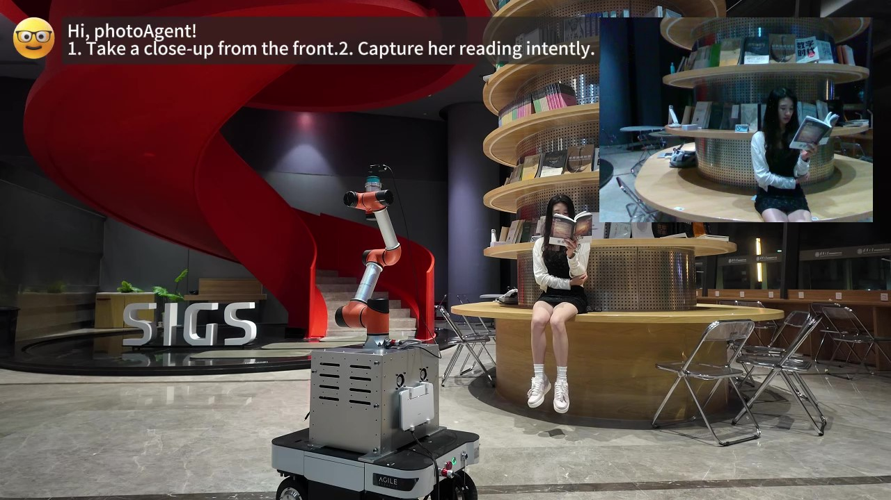

# PhotoAgent: A Robotic Photographer with Spatial and Aesthetic Understanding


## 📌 Project Overview
**PhotoAgent** is an embodied AI photography system that integrates spatial reasoning, aesthetic evaluation, and robotic control.  
It interprets high-level user instructions and autonomously determines optimal viewpoints via **language-guided reasoning** and **geometry-aware scene understanding**.  
The system supports complex scenarios requiring both **semantic intent comprehension** and **precise camera positioning**.

---

## 📄 Paper & Appendix
- **arXiv complete version (Main Paper + Appendix): _coming soon_**  
- **Appendix PDF**: [Download Appendix](assets/appendix_examples.pdf)
  - Detailed methodology breakdown
  - Additional experimental results
  - Extended visual examples

---

## 🎥 Demo Video
[](demo/demo.mp4)

---

## 🖼 Visual Highlights

### 1) Spatial Reasoning Workflow
**The detailed procedures in the process of spatial reasoning.**  


### 2) Experimental Scenes
**The eight scenarios used in our experiments.**  


---

## 📂 Repository Layout
```
.
├── assets/
│   ├── overview_photoagent.png
│   ├── spatial_reasoning_steps.png
│   ├── experimental_scenes.png
│   └── appendix_examples.pdf
├── demo/
│   └── demo.mp4
└── README.md
```

---

## 🚧 Code & Paper
**Coming soon.**  
We are organizing the codebase and LaTeX sources; the complete arXiv version (main paper + appendix) will be linked here once available.

---

## 📬 Contact
For inquiries or collaborations: **clr24@mails.tsinghua.edu.cn**
